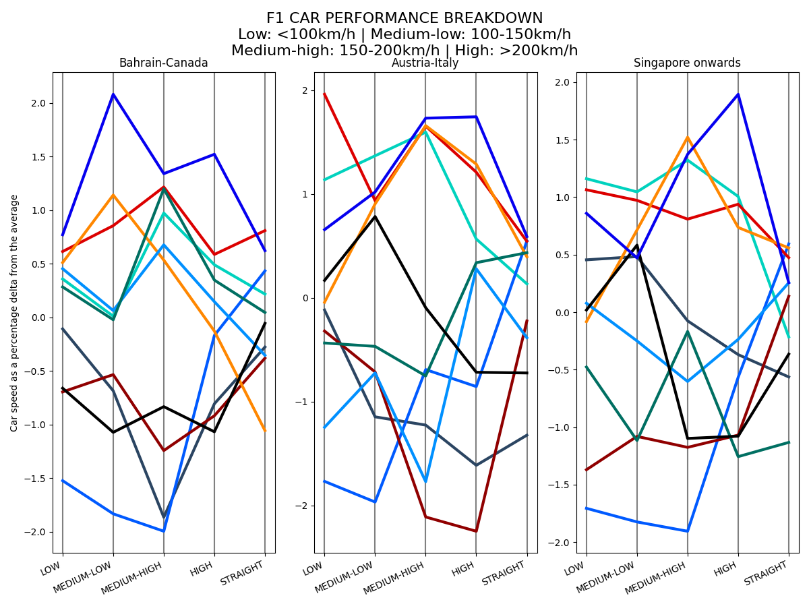
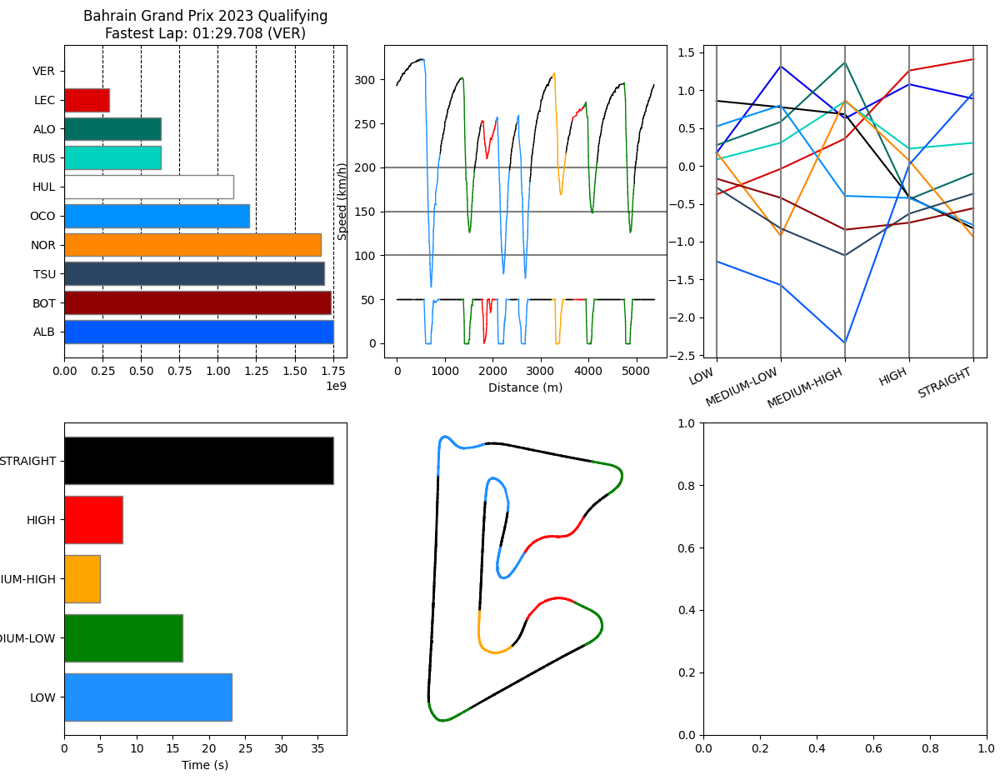

# Formula 1 Cornering Performance Breakdown

This is the python code I use to assess the performance all the F1 teams. An example of the output of this tool is presented below:



It's also possible to focus on a single qualifying session:


## Usage

In order to get the data necessary to create the parallel coordinate plots previously shown, one needs to generate `cornering_data.json` first (this takes a while):

```bash
python3 gen_data.py
```

After this first script is finished, simply run `cornering_performance.py` to get a parallel coordinate plot as show in the first image:

```bash
python3 cornering_performance.py
```

The script `trackviz.py` can be used to get the visualization shown in the second image.

```txt
Usage:
  trackviz.py year 'all' (shows the viz for every quali session of a given year)
  trackviz.py year round_number (specific quali session)
```

The script `track_clustering.py` can be used to perform K-means clustering analysis on the racetracks of the 2024 Formula 1 season.

```txt
Usage:
  track_clustering.py gen | generate 'track_corners_db.json'
  track_clustering.py run | runs the K-means clustering method on the 'track_corners_db.json' data
```

## Run these commands to set up your environment

```bash
virtualenv .env # Only need to run this once
source .env/bin/activate
python3 -m pip install -r requirements.txt
```
